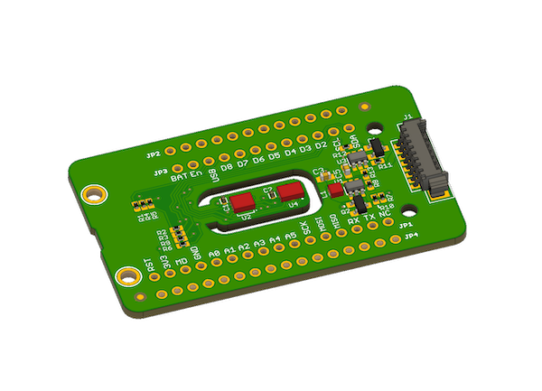

# Air Quality Wing Library!

The Air Quality Wing (Previously Particle Squared) is a circuit board that helps you monitor the air quality around you. This repository is the code for the Air Quality Wing which enables you to monitor humidity, temperature, air particulates, eC02 and TVOCs in one small package.

You can use it with an Adafruit Feather compatible board. [For more information click here.](https://docs.jaredwolff.com/air-quality-wing/index.html)

[To get yours go here.](https://www.jaredwolff.com/store/air-quality-wing/)

## Usage

This library is included with the [Air Quality Wing sample code.](https://github.com/circuitdojo/air-quality-wing-code)

## LICENSE
Copyright 2019 Jared Wolff (Circuit Dojo LLC)

Licensed under the GNU General Public License v3.0 license
